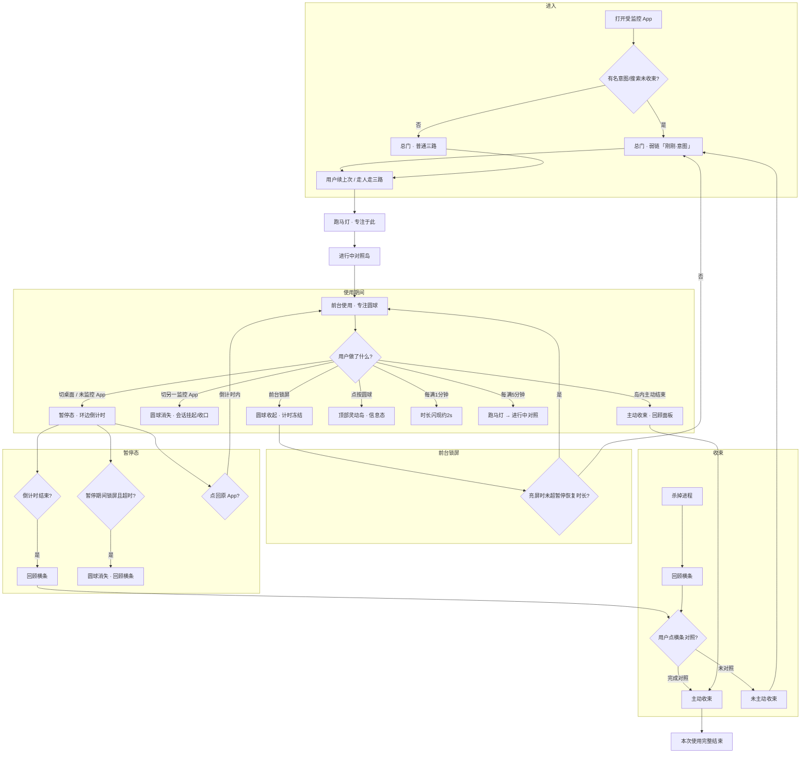
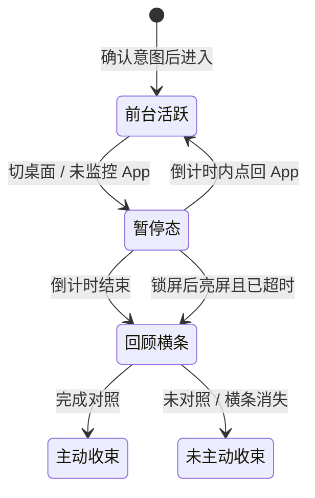
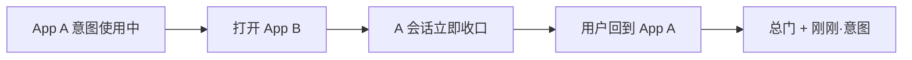
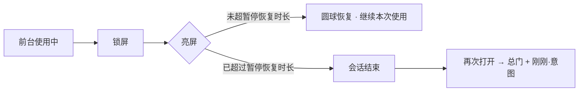
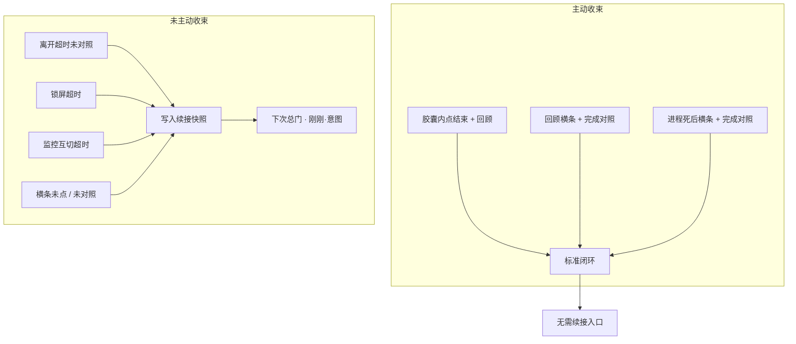
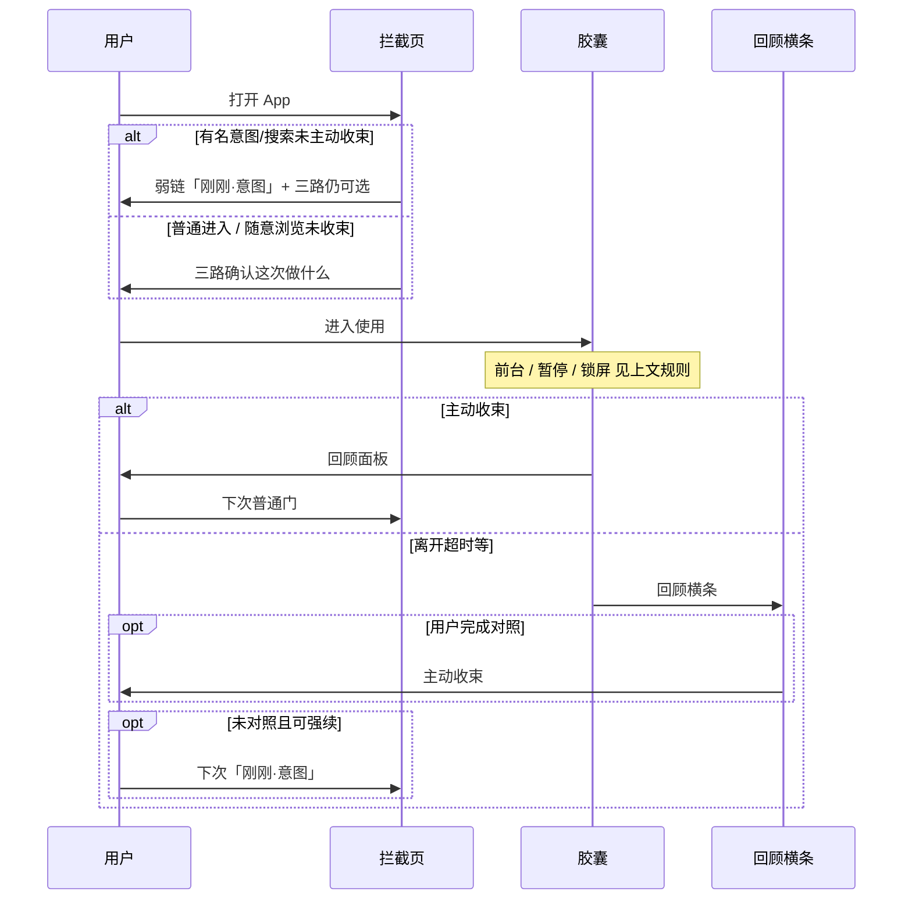

# 拦截页与胶囊 · 场景规则

> 适用场景：**已开启意图门**的受监控 App。用户通过拦截页确认意图后进入使用，陪伴层负责节律提醒与收束。

---

## 一、核心概念

| 术语 | 说明 |
|------|------|
| **拦截页** | 打开受监控 App 时弹出的全屏页，用户需确认使用意图后才能进入。 |
| **专注圆球** | 使用期间默认态：很小的呼吸/扩散圆，无文字无常驻计时，可任意区域悬停。表示「有事正在进行」。 |
| **灵动岛** | 点按圆球后固定出现在屏幕顶部中央的信息岛：意图、用时、今日该 App 摘要、结束等。 |
| **跑马灯** | 入场及每 5 分钟（前台累计）横向滚过本次意图，提醒专注于此。 |
| **进行中对照** | 跑马灯后很快展开的轻确认：「还在做这件事吗？」；未专注时仅轻提醒尽快退出（不强制踢出）。 |
| **前台使用** | 用户正在该受监控 App 内，圆球处于**活跃计时**状态。 |
| **暂停态** | 用户离开该 App（回到桌面或打开未监控 App），圆球进入暂停，环边显示**离开倒计时**（即下文「暂停恢复时长」）。 |
| **暂停恢复时长** | 离开后可「点回继续」的窗口，**默认 2 分钟**（可配置 1 / 2 / 5 分钟）。驱动暂停环边进度。 |
| **回顾横条** | 会话以非主动方式结束后，在屏幕顶部弹出的轻量条，引导用户做「对照一下」完成回顾。 |
| **「刚刚 · 意图」** | 总门弱链续接：上次**有名意图 / 搜索直达**未主动收束时，可一键续该意图，或走人走三路开新一次。只报意图，不报中断原因。**随意浏览不进强续。** |
| **收束** | 一次带意图的使用行为的结束。分**主动收束**与**未主动收束**两类。 |

### 陪伴层节律（摘要）

| 形态 | 触发 | 行为 |
|------|------|------|
| 专注陪伴条 | 默认 | 双行时间胶囊：呼吸点 + **本次 mm:ss[/限额分]** + **今日N分**；文字描边；点按 → 顶部灵动岛 |
| 意图跑道 | 入场；节律对照前 | **全宽半透明带**：先铺开再慢速跑马灯；不占灵动岛 |
| 进行中对照 | 首次满 5 分钟，之后间隔 8 → 12 分钟 | 跑道结束后很快开岛；仍专注 → 回陪伴条；没有专注 → SoftExit |
| 信息岛 | 点按圆球 | 顶部中央；意图/用时/今日摘要/结束 |

限额「还剩 5 分钟」与「进行中对照」分开；冲突时**预算紧急优先**。纯时长锁无定格与进行中对照。

---

## 二、规则总览

---

## 二-附、陪伴层形态与节律

| 形态 | 触发 | 行为 |
|------|------|------|
| **专注圆球** | 默认 | 无字；任意拖拽，松手记住位置（按 App）；点按 → 顶部灵动岛 |
| **分钟闪现** | 前台每跨整分钟 | 圆球旁短暂显示已用（约 2s）；暂停/岛展开/跑马灯期间跳过 |
| **跑马灯** | 入场；之后每 5 分钟前台累计 | 「专注于此 · {意图}」横向滚过；随后很快进入对照岛 |
| **进行中对照** | 跑马灯结束 | 「还在做这件事吗？」；仍专注 → 回圆球；没有专注 → SoftExit 轻提醒 |
| **SoftExit** | 对照选择未专注 | 文案提醒尽快退出；主按钮结束本次 / 次按钮再待一会儿；**不强制踢出** |
| **信息岛** | 点按圆球 | 顶部中央；意图/用时/今日摘要/结束；无操作约 5s 收回（紧急限额除外） |

限额「还剩 5 分钟」预警与「每 5 分钟对照」分开：同一时刻**预算紧急优先于对照**。

纯时长锁：圆球仍可点开岛；无跑马灯与进行中对照节律。

---

## 三、使用期间：三种离开路径

### 3.1 切到桌面或未监控 App → **进入暂停态**

| 项目 | 行为 |
|------|------|
| 陪伴层 | 变为**暂停态**（非消失），环边显示离开倒计时 |
| 计时 | 离开倒计时**持续流逝**（墙钟驱动，锁屏/Doze 不停）；环边同步剩余时间 |
| 暂停态 + 锁屏 | **不拆圆球**；系统若拆掉悬浮窗，亮屏立即重挂；倒计时不停 |
| 倒计时结束 | 弹出**回顾横条**；用户可点横条触发回顾 → **主动收束** |
| 暂停期间锁屏再亮屏 | 若亮屏时倒计时**已结束**：圆球消失，弹出**回顾横条** |
| 在倒计时内点回原 App | 圆球恢复**前台活跃计时**，会话继续 |

### 3.2 切到另一受监控 App → **圆球消失**

| 项目 | 行为 |
|------|------|
| 胶囊 | **立即消失** |
| 会话 · **含意图门** | **确认互切后立即收口**（`SWITCHED_AWAY`），不算无缝续用；回到原 App 时弹出**带「继续」的拦截页**。前台闪报（无障碍/UsageStats 短暂误报另一监控包）经 **1.5s 防抖**过滤，不误收口 |
| 会话 · 仅时长锁等 | 挂起宽限，期内可无缝回切；超时后按**未主动收束**收口 |
| 下次进入原 App | 若上次为**有名意图 / 搜索**且未主动收束 → 总门弱链「刚刚 · 意图」；随意浏览 → 普通三路 |

> **补充规则（意图门互切）**：使用意图胶囊期间跳到另一个受监控 App，再切回来——属于**【继续】场景**，不走桌面暂停胶囊的无缝恢复；有名意图 / 搜索应弹出带「刚刚 · 意图」的总门。

### 3.3 前台使用期间锁屏 → **计时冻结**

| 项目 | 行为 |
|------|------|
| 锁屏瞬间 | 胶囊**收起 / 暂停计时**（不计入使用时长） |
| 亮屏 · 未超暂停恢复时长 | 胶囊**恢复计时**，会话静默续用，**不重新弹拦截页** |
| 亮屏 · 已超过暂停恢复时长 | 会话结束；再次打开时若属有名意图 / 搜索，总门出「刚刚 · 意图」 |

---

## 四、一次使用的收束方式

「收束」= 这次带意图的使用如何结束，以及是否留下可续接的快照。

### 4.1 主动收束（标准闭环）

用户**明确完成回顾**的三种路径：

| # | 触发场景 | 路径 |
|---|----------|------|
| 1 | 胶囊展开态 | 用户点击**结束** → 回顾弹框面板 → 完成回顾 |
| 2 | 暂停态倒计时结束 | 弹出**回顾横条** → 用户点击并完成对照 |
| 3 | 杀掉进程 | 弹出**回顾横条** → 用户点击并完成对照 |

> **主动收束**后，下次进入该 App 走普通拦截流程，**不显示**续接弱链。

### 4.2 未主动收束

除上述三种主动收束外，其余结束方式均视为**未主动收束**，例如：

- 离开超时（暂停倒计时走完）但用户**未点回顾横条**
- 前台锁屏超过暂停恢复时长
- 切到另一监控 App 且挂起超时
- 进程被杀但用户**未点回顾横条**
- 其他系统中断

| 后果 | 说明 |
|------|------|
| 下次进入 · 写下意图 / 搜索直达 | 总门底区弱链 **「刚刚 · {意图}　继续」**；不报中断原因；三路仍是主决策 |
| 下次进入 · 随意浏览 | **不出**强续；走普通三路（避免无意识连刷） |
| 有效期 | 结束后 **10 分钟内**；须未主动收束 + 时长 ≥ 5 秒 + 有名意图/搜索；否则普通门 |

---

## 五、场景速查表

| 场景 | 胶囊 | 会话 | 回顾横条 | 下次进入 |
|------|------|------|----------|----------|
| 前台正常使用 | 活跃计时 | 进行中 | — | — |
| 切桌面 / 未监控 App | 暂停态 + 倒计时 | 进行中 | 倒计时结束后弹出 | 倒计时内点回可续 |
| 暂停态 + 锁屏后亮屏（已超时） | 消失 | 结束 | 弹出 | 有名意图/搜索未对照 → 刚刚·意图 |
| 切另一监控 App（意图门） | 消失 | 立即收口 | — | 回切 · 有名意图/搜索 → 刚刚·意图 |
| 切另一监控 App（仅时长锁） | 消失 | 挂起 → 可能结束 | — | 有名意图/搜索未收束 → 刚刚·意图 |
| 前台锁屏 · 未超时亮屏 | 恢复 | 继续 | — | — |
| 前台锁屏 · 超时亮屏 | — | 结束 | — | 有名意图/搜索 → 刚刚·意图 |
| 胶囊内主动结束 | 消失 | 主动收束 | — | 普通拦截 |
| 杀掉进程 | 消失 | 结束 | 延迟弹出 | 对照后收束；有名意图/搜索未对照 → 刚刚·意图 |

---

## 六、与拦截页的关系

---

## 七、实现备注（研发对齐）

| 产品概念 | 代码 / 配置 | 备注 |
|----------|-------------|------|
| 暂停恢复时长 | `awayCountdownSeconds`，默认 120s | 用户可配 60 / 120 / 300 秒；**前台息屏宽限与之相同** |
| 暂停态 + 锁屏 | `startAwayCountdown` | 离开倒计时锁屏期间继续流逝；归零弹回顾横条 |
| 监控 App 互切（意图门） | `noteMonitoredSwitchCandidate` → `parkSessionForMonitoredAppSwitch` | 活会话下先 **1.5s 防抖**；确认后立即 `SWITCHED_AWAY`；回切走拦截「继续」 |
| 监控 App 互切（仅时长锁） | `parkCurrentSessionForSwitch` | 宽限期内可无缝回切 |
| 离开/息屏倒计时 | `awayCountdownDeadlineElapsedMs` / `screenOffDeadlineElapsedMs` | 墙钟驱动，锁屏 Doze 下仍准确 |
| 回顾横条 | `AwayEndedBarOverlay` | 点「对照一下」并保存 → 主动收束（`endReason` 升为 `MANUAL`）；环尽未点 → 未主动收束 |
| 「刚刚 · 意图」 | `PendingInterrupt.isStrongResumeEligible` + 总门弱链 | 须未主动收束原因 + 有名意图/搜索（非随意浏览）+ 时长 ≥ 5s；**10 分钟内**有效 |

---

## 八、原文对照

本节保留作者原始描述，供追溯：

> **拦截页和胶囊 场景规则**
>
> 概念说明：暂停恢复时长：默认 2 分钟
>
> 胶囊使用（前台）期间：
> - 若跳到桌面和第三方未监控 app，则胶囊变为暂停状态；
> - 暂停状态：根据进度条流逝来计时，遇到锁屏也同样计时生效，计时结束后，弹出回顾横条。（若暂停状态期间锁屏，超过了【暂停恢复时长】后再次亮屏，则圆球消失并弹出回顾横条）
> - 若跳到另外监控 app 里，则圆球消失；
>
> 前台期间若遇到锁屏，则胶囊暂停计时，再次亮屏时，如果时间未超过【暂停恢复时长】，则圆球恢复计时，如果超过【暂停恢复时长】，则再次出现拦截页；有名意图/搜索未收束时显示出「刚刚 · 意图」弱链。
>
> 一次带有意图的使用行为，有以下几种收束的情况：
> 1. 在胶囊展开态里，主动点击结束-回顾收束（通过回顾弹框面板）
> 2. 暂停状态进度条结束后：弹出回顾横条-点击触发回顾主动收束。
> 3. 杀掉进程：弹出回顾横条-点击触发回顾主动收束。
>
> 其他情况都是未主动收束的情况。如果进入一个拦截 app，上一次为有名意图/搜索且未收束，则显示出「刚刚 · 意图」弱链；随意浏览不进强续。
